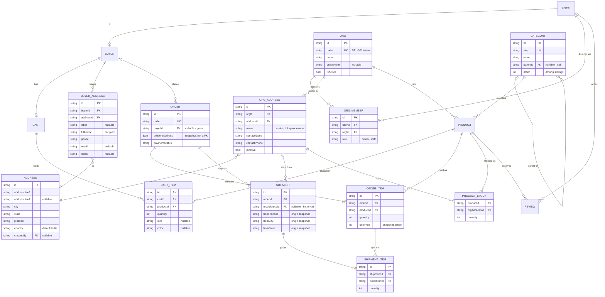

# Data model — revised relational diagram

- **Status:** Draft — all six open items closed 2026-08-08
- **Verified:** 2026-08-08
- **References:** [spec.md](stock-locations-and-allocation/spec.md), [trd.md](stock-locations-and-allocation/trd.md), [consumer-inventory.md](consumer-inventory.md), [CONTRACTS.md](../../CONTRACTS.md)

A supporting artifact, not line-capped ([ADR-0010](../../adr/0010-spec-convention.md)). This is the target
model, not the current schema — `prisma/schema.prisma` remains authoritative for what exists today.
Renders natively on GitHub and in any Mermaid-aware Markdown preview.

Payment, shipping provider, rate cache, shipping events and admin log are omitted for legibility,
not deleted.

## New tables

| Table | Why it exists |
|---|---|
| `ORG_MEMBER` | `USER`↔`ORG` many-to-many. A user can operate several orgs and an org can have several operators. `role` distinguishes an owner from staff; what each may do is an authorization question this model only makes expressible. |
| `ORDER_ITEM` | Quantity and the unit price as it stood when bought. A real FK to `PRODUCT` with `onDelete: Restrict`, so deleting a sold product fails loudly instead of orphaning a JSON blob — and per-product revenue becomes a SQL question rather than an application loop. |
| `SHIPMENT_ITEM` | What physically went into one parcel, pointing at an `ORDER_ITEM`. This is what makes splits expressible: a line of 13 becomes 3 from the shop and 10 from the warehouse, with both halves still linked to the one thing the customer ordered. |
| `PRODUCT_STOCK` | The `PRODUCT`↔`ORG_ADDRESS` many-to-many, named and given its payload. Quantity lives here, never on `PRODUCT`; the customer-facing figure is the sum across rows ([trd.md](stock-locations-and-allocation/trd.md) D2, D3). |
| `CART_ITEM` | Quantity and the chosen size and colour need a row. Also turns the sign-in cart merge into a set operation rather than surgery on a JSON array. |

## Changed

| What | Change |
|---|---|
| `SELLER` → `ORG` | A vendor is an organisation with people in it, not a person. Renamed throughout, and `USER`→`ORG` becomes many-to-many through `ORG_MEMBER` rather than the 1:1 it was drawn as. |
| `BUYER \|o--o{ ORDER` | Optional on the buyer side, so guest checkout survives — `Order.userId` is already nullable and the repository writes `input.userId ?? null`. A guest order is identified by its code plus the name and phone on the delivery snapshot. |
| `ORDER.deliveryAddress` | A snapshot, **not** a link to `BUYER_ADDRESS`. A buyer editing their address must not rewrite where a delivered order went — same reasoning as [ADR-0002](../../adr/0002-server-holds-pricing-authority.md) keeping price on the order. |
| `CATEGORY \|o--o{ CATEGORY` | Self-referencing parent, so depth is unlimited and a third level needs no migration. `PRODUCT.categoryId` stays a single FK — it already was. |
| `ORG_ADDRESS` | Explicitly a pickup location: courier nickname, contact name and phone, active flag. A business address and a place a courier collects from are not the same record. |

## Dropped

- **`SUBCATEGORY`** — two hardcoded levels, and its many-to-many with `PRODUCT` was flags in disguise; `ProductFlag` already covers "New Arrival" and "Clearance".
- **`isDefault`**, everywhere. Nothing is preselected: a buyer chooses a delivery address at checkout, and whoever creates a product chooses its location explicitly. That choice *is* a `PRODUCT_STOCK` row — which location, and how many are there.

## Referential actions to set deliberately

| Relation | Action | Why |
|---|---|---|
| `ORDER_ITEM.productId` | `Restrict` | A sold product cannot be deleted out from under its order history. |
| `PRODUCT.categoryId` | `Restrict` | Currently `Cascade` — deleting a category would delete its products, guarded only in `adminCategoryService`. |
| `CATEGORY.parentId` | `Restrict` | A parent with children cannot be deleted. |
| `PRODUCT_STOCK.orgAddressId` | `Restrict` | Satisfies spec R8 in the database rather than a service check. |
| `ORG_MEMBER.userId` / `.orgId` | `Cascade` | A membership is meaningless without both ends; deleting either removes the link, not the other party. |
| `AdminLog.adminId` | not `Cascade` | Currently `Cascade`: deleting an admin erases the audit trail of what they did. |

## Rules the database cannot express

- **No cycles in the category tree.** `parentId` permits A→B→A and Postgres cannot forbid it declaratively. Before a parent is set, walk up from the proposed parent through its ancestors and reject if the node being edited appears — also rejecting self-parenting. Raised as a `DomainError` on the `parentId` field so it lands inline ([ADR-0013](../../adr/0013-one-error-envelope-and-useserverform.md)).
- **One membership per user per org.** `@@unique([userId, orgId])` on `ORG_MEMBER` covers it; the role is an attribute of the one membership, not a second row.

## Resolved

Closed 2026-08-08. Kept so the reasoning survives the decision.

1. **`USER`↔`ORG` is many-to-many** via `ORG_MEMBER`, replacing the 1:1 `USER`→`SELLER`.
2. **No `isDefault`.** The buyer selects an address at checkout; the product's location is set when the product is created.
3. **Category subtree reads** are computed in application code — load the category table, collect descendant ids, query `categoryId: { in: [...] }`. No path column, no recursive CTE, no schema addition.
4. **Cycles prevented** on the write path, as above.
5. **`ORDER_ITEM.unitPrice` is integer paise from birth**, so it is not migrated twice by [money-as-paise](../money-as-paise/). This is a storage and arithmetic decision only — nobody types paise into a form; the boundary converts ₹1,200.50 to `120050` on the way in and back on the way out ([ADR-0004](../../adr/0004-money-as-integer-paise.md)).
6. **`CART_ITEM` over a JSON cart**, reversing the YAGNI position in [trd.md](stock-locations-and-allocation/trd.md) — it is the more standard and more consistent choice once everything else is relational.
